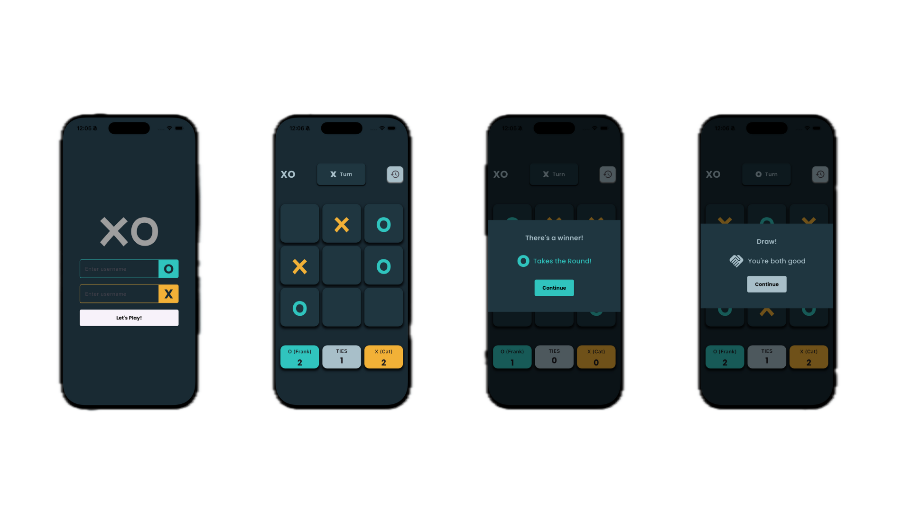

## 📸 Screenshots

> Replace the paths with your actual screenshots

# 🟦 Tic Tac Toe – Flutter Edition  
A modern and responsive Tic Tac Toe game built with **Flutter**, featuring smooth UI, player name input, and a clean game board.

---

## ✨ Features

- 🎮 **Two-player mode** (Player vs Player)
- 👤 **Custom player names** via intro screen
- 🟦 Clean and responsive UI
- 🔁 Automatic win detection & board reset
- 📱 Works on Android, iOS, and Web
- 🎨 Simple and beautiful layout

---

